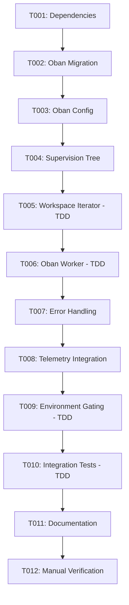

# Sprint: Automatic GSC Sync with Oban

## Sprint Goal
Implement automatic background syncing of Google Search Console data every 6 hours, fetching the last 14 days of data for all active workspaces, controlled by environment variable.

## Configuration
- **Scheduler:** Oban (enterprise-grade job queue)
- **Frequency:** Every 6 hours (`0 */6 * * *`)
- **Scope:** Last 14 days per run
- **Control:** Environment variable (`ENABLE_AUTO_SYNC=true`)

## Sprint Overview
- **Total Tickets:** 12
- **Story Points:** ~21 points
- **Estimated Duration:** 2-3 days
- **TDD Approach:** Yes, for Worker, Sync logic, and Integration tests

## Ticket Status
- 🔵 **Not Started:** 12 tickets
- 🟡 **In Progress:** 0 tickets
- 🟢 **Completed:** 0 tickets
- 🔴 **Blocked:** 0 tickets

## Sprint Board Columns
1. **Backlog** - Tickets ready to start
2. **In Progress** - Currently working on
3. **Testing** - Implementation done, tests in progress
4. **Review** - Ready for validation
5. **Done** - Completed and verified

## Dependencies

## Ticket Breakdown
See individual ticket files for detailed implementation specs.

## 📚 Research Documentation

**Comprehensive research documentation** has been gathered from official sources to support implementation:

**Central Index:** [Documentation Index](docs/DOCUMENTATION_INDEX.md)

### Quick Links:
- **Oban Job Queue** - [Reference Guide](/Users/flor/Developer/prism/docs/OBAN_REFERENCE.md) (41KB, v2.20.1)
- **Elixir TDD Best Practices** - [Complete Guide](/Users/flor/Developer/prism/docs/elixir-tdd-research.md) (41KB)
- **Testing Quick Reference** - [Quick Guide](/Users/flor/Developer/prism/docs/testing-quick-reference.md) (13KB)
- **Phoenix & Ecto Patterns** - [Research Doc](/Users/flor/Developer/prism/docs/phoenix-ecto-research.md) (35KB)
- **Error Handling & Resilience** - [Complete Guide](/Users/flor/Developer/prism/docs/elixir_error_handling_research.md) (45KB)
- **Cron Scheduling** - [Scheduling Guide](/Users/flor/Developer/prism/docs/cron-scheduling-research.md) (28KB)
- **Environment Configuration** - [Config Guide](/Users/flor/Developer/prism/ENVIRONMENT_CONFIG_RESEARCH.md) (32KB)

**All documentation includes:**
- Official source URLs for verification
- Code examples ready to use
- Best practices from 2024-2025
- Production deployment patterns

Each ticket now links to relevant documentation in its "Reference Documentation" section.

## Testing Strategy
- **Unit Tests:** Worker logic, workspace iteration, environment gating
- **Integration Tests:** Full sync flow with Oban
- **Manual Tests:** Verify Oban dashboard, cron scheduling, multi-workspace handling

## Success Criteria
- [ ] Oban successfully installed and configured
- [ ] Worker syncs all active workspaces every 6 hours
- [ ] Environment variable controls scheduling
- [ ] Error handling and retries work correctly
- [ ] Telemetry events logged to audit log
- [ ] All tests pass (>95% coverage for new code)
- [ ] Documentation updated
- [ ] Manual verification successful
