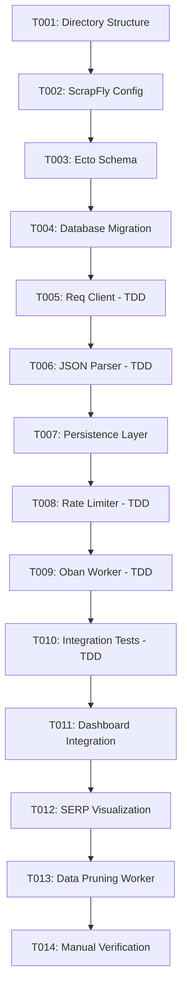

# Sprint: ScrapFly SERP Integration

## Sprint Goal
Integrate ScrapFly API to provide real-time SERP position checking for GSC Analytics dashboard URLs, enabling validation of Google Search Console ranking data against actual search results.

## Configuration
- **API Provider:** ScrapFly (JSON API, not markdown)
- **HTTP Client:** Req (Prism standard, NOT :httpc)
- **Queue:** Oban `serp_check` queue (3 concurrent workers)
- **Scope:** On-demand SERP checks triggered from dashboard
- **Retention:** 7-day automatic snapshot pruning

## Sprint Overview
- **Total Tickets:** 14
- **Story Points:** ~23 points
- **Estimated Duration:** 3-4 days
- **TDD Approach:** Yes, for Client, Parser, Worker, Rate Limiter, Integration tests

## Ticket Status
- 🔵 **Not Started:** 14 tickets
- 🟡 **In Progress:** 0 tickets
- 🟢 **Completed:** 0 tickets
- 🔴 **Blocked:** 0 tickets

## Sprint Board Columns
1. **Backlog** - Tickets ready to start
2. **In Progress** - Currently working on
3. **Testing** - Implementation done, tests in progress
4. **Review** - Ready for validation
5. **Done** - Completed and verified

## Dependencies


## Ticket Breakdown
See individual ticket files for detailed implementation specs.

## 📚 Research Documentation

**Comprehensive research documentation** has been gathered to support implementation:

**Central Index:** [Documentation Index](docs/DOCUMENTATION_INDEX.md)

### Quick Links:
- **Req HTTP Client** - [HexDocs](https://hexdocs.pm/req) (Prism standard)
- **Oban Job Queue** - [Reference Guide](/Users/flor/Developer/prism/docs/OBAN_REFERENCE.md) (41KB, v2.20.1)
- **Elixir TDD Best Practices** - [Complete Guide](/Users/flor/Developer/prism/docs/elixir-tdd-research.md) (41KB)
- **Testing Quick Reference** - [Quick Guide](/Users/flor/Developer/prism/docs/testing-quick-reference.md) (13KB)
- **Phoenix & Ecto Patterns** - [Research Doc](/Users/flor/Developer/prism/docs/phoenix-ecto-research.md) (35KB)
- **Error Handling & Resilience** - [Complete Guide](/Users/flor/Developer/prism/docs/elixir_error_handling_research.md) (45KB)
- **ScrapFly SERP API** - [Official Docs](https://scrapfly.io/docs/scrape-api/serp)
- **Codex Architecture Review** - [Summary](docs/RESEARCH_SUMMARY.md)

**All documentation includes:**
- Official source URLs for verification
- Code examples ready to use
- Best practices from 2024-2025
- Production deployment patterns

Each ticket links to relevant documentation in its "Reference Documentation" section.

## Architecture

### Module Organization (Data Sources Pattern)
```
lib/gsc_analytics/data_sources/serp/
├── core/
│   ├── client.ex          # Req-based ScrapFly API client
│   ├── parser.ex          # JSON SERP response parser
│   ├── persistence.ex     # Database operations
│   └── config.ex          # Configuration management
├── support/
│   ├── rate_limiter.ex    # API quota management
│   └── retry_helper.ex    # Exponential backoff
└── telemetry/
    └── audit_logger.ex    # Structured logging
```

### Database Schema
```elixir
# serp_snapshots table
create table(:serp_snapshots, primary_key: false) do
  add :id, :binary_id, primary_key: true

  # Relations (FIXED: Use property_id, not URLs)
  add :account_id, references(:accounts), null: false
  add :property_id, references(:properties), null: false
  add :url, :string, null: false

  # SERP Data
  add :keyword, :string, null: false
  add :position, :integer
  add :serp_features, {:array, :string}, default: []
  add :competitors, {:array, :map}, default: []
  add :raw_response, :map  # Full JSON response

  # Metadata
  add :geo, :string, default: "us"
  add :checked_at, :utc_datetime, null: false
  add :api_cost, :decimal
  add :error_message, :string

  timestamps(type: :utc_datetime, updated_at: false)
end

# Indexes
create index(:serp_snapshots, [:property_id, :url, :keyword])
create index(:serp_snapshots, [:checked_at])  # For pruning
create unique_index(:serp_snapshots,
  [:property_id, :url, :keyword, :checked_at],
  name: :serp_snapshots_unique_check
)
```

### Key Design Decisions (Based on Codex Review)

**1. HTTP Client: Req (NOT :httpc)**
- ✅ Prism standard for new integrations
- ✅ Consistent telemetry, retries, JSON handling
- ✅ Centralized TLS/runtime config
- ❌ NOT using :httpc (even though GSC module uses it)

**2. API Response Format: JSON (NOT Markdown)**
- ✅ ScrapFly SERP API returns structured JSON
- ✅ Use built-in JSON module (Elixir 1.18+)
- ❌ NOT parsing markdown (incorrect assumption)

**3. Data Modeling: Proper Foreign Keys**
- ✅ Reference property_id (not just copy URLs)
- ✅ Enforce tenancy with @current_scope
- ✅ Proper relational integrity

**4. Idempotency: Oban Unique Periods**
- ✅ Dedupe key: `{property_id, url, keyword, geo}`
- ✅ 1-hour unique period
- ✅ Prevents duplicate API costs

**5. Authentication: LiveView Scope**
- ✅ All LiveView routes under `live_session :require_authenticated_user`
- ✅ Enforce @current_scope for data filtering
- ✅ Property-level authorization

## Testing Strategy
- **Unit Tests:** Client, Parser, Persistence, Rate Limiter
- **Integration Tests:** Full SERP check flow with Oban
- **Rate Limiter Tests:** Quota management, backoff logic
- **Failure Path Tests:** API errors, quota exhaustion, retries
- **Manual Tests:** ScrapFly API calls, position accuracy

## Success Criteria
- [ ] Req-based ScrapFly client working
- [ ] JSON parser extracts position accurately
- [ ] Oban worker processes jobs with idempotency
- [ ] Rate limiter prevents quota exhaustion
- [ ] LiveView button triggers SERP checks (with auth)
- [ ] Position displayed alongside GSC data
- [ ] 7-day auto-pruning works
- [ ] All tests pass (>95% coverage for new code)
- [ ] mix precommit passes
- [ ] Documentation updated

## Cost Management
- **Free Credits:** 1 million ScrapFly credits available
- **Cost per Query:** ~31 credits (base + JS rendering + residential proxy)
- **Free Queries:** ~32,258 SERP checks
- **Rate Limiting:** Prevents accidental quota exhaustion
- **Tracking:** api_cost field records credits used

## Codex Review Feedback Applied

### Critical Fixes
✅ Changed HTTP client from :httpc to Req
✅ Changed parser from markdown to JSON
✅ Added property_id foreign key
✅ Added Oban unique_periods for idempotency
✅ Split testing into granular tickets
✅ Added data pruning worker
✅ Documented auth/scope requirements

### Additional Improvements
✅ Config ticket documents env vars in runtime.exs
✅ Storage plan includes pruning job + indexes
✅ Dashboard UX defines pending/failed states
✅ Manual verification has acceptance criteria

See [docs/RESEARCH_SUMMARY.md](docs/RESEARCH_SUMMARY.md) for full Codex review.
